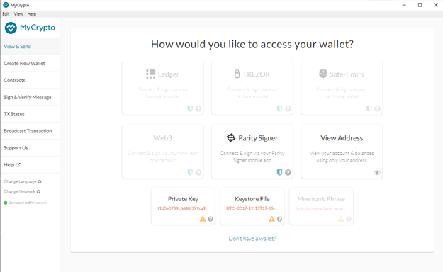
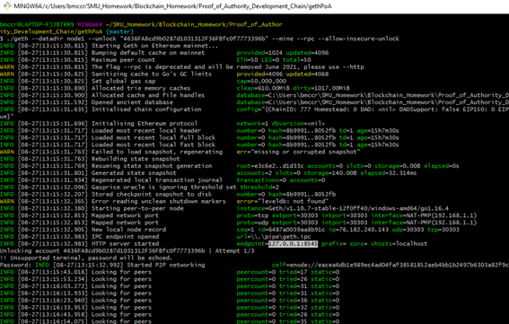
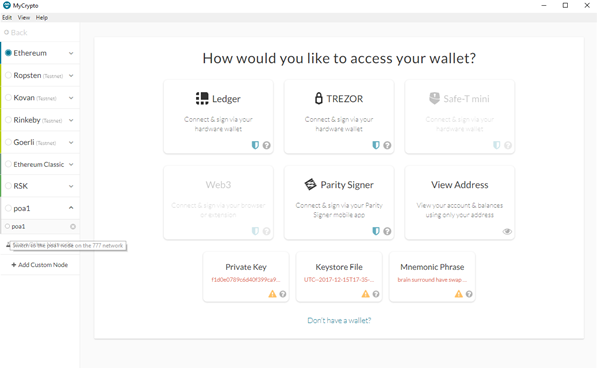
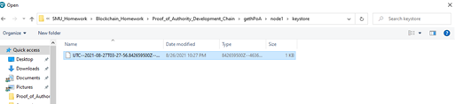
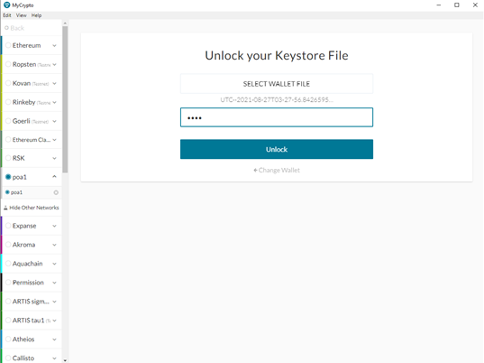
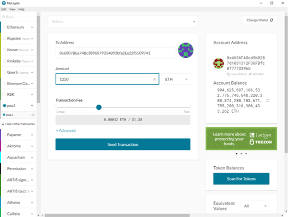
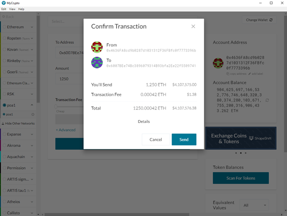
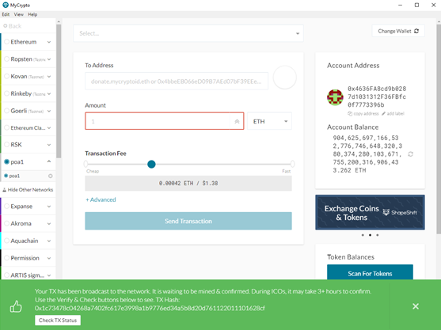
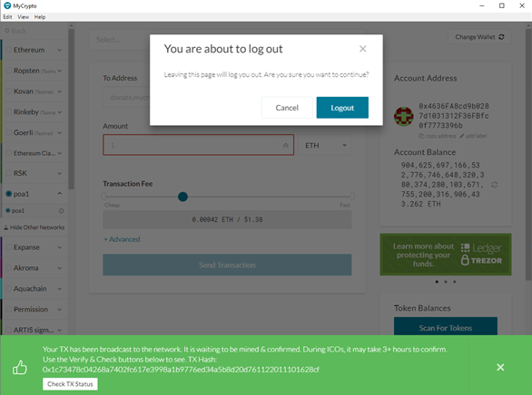
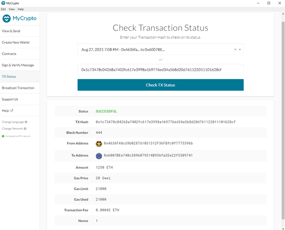

# 🧱🔗 Proof_of_Authority_Development_Chain 🧱🔗
Setting up a custom testnet blockchain, send a transaction, create a repository, and document the steps of how this process is done.
This tutorial will provide you with step-by-step instructions on how to create your own private Proof of Authority Blockchain.

## What you need to get started
* [Geth](https://geth.ethereum.org/docs/install-and-build/installing-geth)
This is the toolset used to create your nodes and blockchain
* [MyCrypto](https://download.mycrypto.com/)
This is the application we will use to maintain your Ethereum accounts and conduct a trade from one account to another

## Create Nodes
Unzip the Geth CLI toolset and open a git bash(terminal) from the unzipped folder(I renamed my folder "gethPoA")

In git bash, run the following code to create your first node(node1). You will need to create a password, and SAVE THAT PASSWORD!
geth --datadir node1 account new
Your node will have a public address key and a secret key file automatically generated. SAVE THESE! I have listed mine below, but you should always keep your secret key file private. DO NOT SHARE WITH ANYONE OR ONLINE!
Password: 1234
Public address of the key:   0x4636FA8cd9b0287d1031312F36FBfc0f7773396b
Path of the secret key file: node1\keystore\UTC--2021-08-27T03-27-56.842659500Z--4636fa8cd9b0287d1031312f36fbfc0f7773396b

Repeate this same process for your second node(node2). Save the password that you generate, as well as the public address and secret file
geth --datadir node2 account new
Once again, I have shared mine, but you should NEVER SHARE WITH ANYONE OR ONLINE!
Password: 0987
Public address of the key:   0x6007BEe74Bc3896079314B93bfa2Ee22f5509741
Path of the secret key file: node2\keystore\UTC--2021-08-27T03-31-01.280518400Z--6007bee74bc3896079314b93bfa2ee22f5509741

You will notice that new folders have been populated into your unzipped folder labeled as what you named your nodes(node1 & node2)

## Create Proof of Authority network and Genesis Block
In your terminal(git bash) from your unzipped folder, we are going to create our Proof of Authority network. First, run this code to open your Ethereum private network manager.
./puppeth
* Specify a network name(poa1)
* Configure new genesis(option 2)
* Create a new genesis from scratch(option 1)
* Specificy that we want a proof-of-authority consensus engine(option 2)
* Use default 15 second blocks
* List which accounts are allowed to be sealed. Use the public address keys for node1 and node2
* List the public address keys for node1 and node2 as accounts that should be pre-funded
* Answer "no" when asked if the precompiled-addresses should be pre-funded with 1 wei
* Lastly, specify your chain/network ID. Do not generate a random chainID, but rather pick a number(777) and SAVE THAT CHAINID NUMBER!

* Now that we've got our PoA network and genesis block created, let's manage existing genesis(option 2).
* Export genesis configurations(option 2).
* Press enter create the JSON files.

You will notice that 2 new JSON files have been added to your unzipped gethPoA folder, poa1.JSON and poa1-harmony.JSON

If you open the poa1.JSON file, you will see the genesis block. This is where you can find your chainID if you forgot to write it down, as well as other info on the genesis(first) block in your network.

## Initialize and Unlock both nodes
Open a new git bash from your unzipped gethPoA folder. Enter the following codes to initialize node1 and node2
./geth --datadir node1 init poa1.json
./geth --datadir node2 init poa1.json

Now, let's unlock node1 so it can begin mining as well as trying to communicate with other nodes(although it won't be able to communicate with another node until we get node2 unlocked). To do this, enter the following code into your git bash. You will need to alter your code by entering in your public address key(without the beginning "0x") of node1(which will be different than mine) inside of the quotations.
./geth --datadir node1 --unlock "4636FA8cd9b0287d1031312F36FBfc0f7773396b" --mine --rpc --allow-insecure-unlock
Once it has a second to start running, there will be a blank row. Type in your password for node1(1234) and press enter to begin actively mining.

While node1 is still running on your first git bash, open a second git bash from you unzipped gethPoA folder.
Enter in the following code, with some minor adjustments. In the first set of quotation marks, enter in your public address key for node2(withouth the beginning "0x") and then look back into the first git bash, just above where it states that it is looking for peers and you will see self=enode://...
Copy the enode address and paste the contents of the 2nd quotation marks with yours, replacing what I have on my local.
./geth --datadir node2 --unlock "6007BEe74Bc3896079314B93bfa2Ee22f5509741" --mine --port 30304 --bootnodes "enode://eacea6db1e989ec4ad04faf38581852aeb4bb1b2497b6303a82f9c4a63946e70a0c809387b67be8895029034f08de483b078b03c74e373d1b1d31fb114276c74@76.182.240.143:30303" --ipcdisable --allow-insecure-unlock
Again, once it has a second to start running, there will be another blank row. Type in your password for node2(0987) and press enter to begin actively mining.

## MyCrypto setup poa1 network
Open the MyCrypto application

Find the endpoint from node1 which will be toward the top of your 1st git bash terminal and copy it to your clipboard

Back on the MyCrypto app, on the left hand side, click the option to "Change Network"
Setup a custom node. You will need your ChainID as well as the endpoint we just copied from the git bash running node1.
For the URL, enter http:// followed by your endpoint.

Now on that left hand side, scroll down until you find your new poa1 network and select it so that we are now running on our Proof of Authority network, and not the Ethereum main net.

## Setting the Keystore in MyCrypto
Back on the MyCrypto home page, select the Keystore File box in the middle of the bottom row.
Select the keystore file that is found in your unzipped gethPoA folder > node1 > keystore

Then enter the password for node1(1234) and click "Unlock"

# Sending Ethereum from node1 to node2
If you are not automatically directed to the following screen, click View & Send on the left hand side of the MyCrypto app.
We are currently signed in as node1, so enter the public address key of node2 as the "To Address"
Specify the amount and designation(ETH) that you want to send and click "Send Transaction"

Review the details of the transaction you are about to submit. If it all looks good, select "Send"

A green bar will appear at the bottom of the MyCrypto app, click on "Check TX Status"

You will be prompted to log out. Click "Logout"

You might have to refresh from the "pending" stage. The transaction will become complete, and you can review your successful transaction.

## Congratulations! You have successfuly built your own Proof of Authority network and sent Ethereum from one node to another!